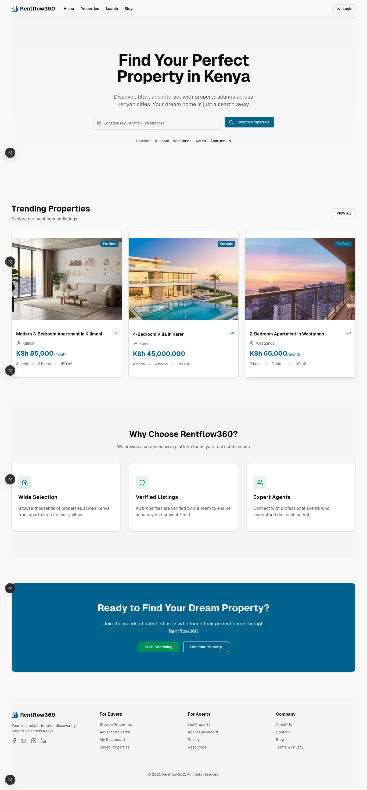

# 🏠 Rentflow360 — Real Estate Platform

Rentflow360 is a **responsive real estate web platform** built for the Web Developer Internship project at **Rentflow360 Realty**.
The platform allows users to **discover, filter, and interact with property listings** across Kenyan cities, supporting multiple user roles such as **guests, registered users, agents, and administrators**.

---

## 🚀 Demo

Here’s a preview of the live prototype:



🔗 **Live Demo:** [\[[Hosted demo link :](https://r-flow360.netlify.app/)\]]

---

## 🧩 Tech Stack

- **Framework:** [Next.js 14](https://nextjs.org/)
- **Language:** [TypeScript](https://www.typescriptlang.org/)
- **State Management:** [Redux Toolkit](https://redux-toolkit.js.org/)
- **UI Components:** [shadcn/ui](https://ui.shadcn.com/)
- **Styling:** [Tailwind CSS](https://tailwindcss.com/)
- **Icons:** [Lucide React](https://lucide.dev/)

---

## 🧭 Features Overview

### 🏡 Homepage

- Clean header and hero section with property search bar.
- Display of trending property listings with rent/sale tags.
- Footer section with navigation and social links.

### 🏘️ Property Listings

- **Page 1:** Displays basic property info (photo, price, location, size).
- **Page 2:** Shows detailed property info (description, amenities, contact info).
- **Page 3:** Full-page photo view with watermark overlay.

### 🔍 Search & Filters

- Search by location, type, price, bedrooms, and amenities.
- Handles **partial or flexible input**, e.g. “1-bedroom Kasarani” or “one bedroom Kasarani”.

### 👥 User Roles

| Role                | Capabilities                                                          |
| ------------------- | --------------------------------------------------------------------- |
| **Guest**           | Browse, search, view listings                                         |
| **Registered User** | Save favorites, set alerts, contact sellers, leave reviews            |
| **Agent/Seller**    | Create, manage, and track property listings                           |
| **Admin**           | Approve/reject listings, manage users, handle reports, view analytics |

### 📊 Dashboards

- **User Dashboard:** Saved listings, notifications, and settings.
- **Agent Dashboard:** Manage listings and inquiries.
- **Admin Dashboard:** Manage users, moderate listings, and view analytics.

---

## 💡 Key Design Decisions

- Built with **Next.js App Router** for better routing, scalability, and SEO.
- Used **Redux Toolkit** for centralized state management and predictable logic.
- Leveraged **shadcn/ui** components for a modern, consistent design.
- Implemented a **mobile-first** layout to ensure full responsiveness.
- Structured the project for potential backend/API expansion.

---

## ⚙️ Setup Instructions

### 1. Clone the repository

```bash
git clone git@github.com:KOKUMUbooker/r-flow360.git
cd r-flow360
```

### 2. Install dependencies

```bash
npm install
```

### 3. Run the development server

```bash
npm run dev
```

The app should now be accessible at **[http://localhost:3000](http://localhost:3000)**

---

## 📱 Responsiveness

The platform is fully optimized for:

- Desktop 🖥️
- Mobile 📱

---

## 🧾 Evaluation Summary

This submission meets all the core project requirements:

- ✅ Responsive homepage with hero, search, and trending properties
- ✅ Property listing and detail views
- ✅ Role-based design
- ✅ Search and filtering
- ✅ Clean UI/UX and maintainable structure

---

## 🧠 Future Enhancements

- Integrate backend APIs for live listings ,reports, reviews, inquiries and authentication
- Add robust auth mechanism
- Enable real-time messaging between buyers and agents
